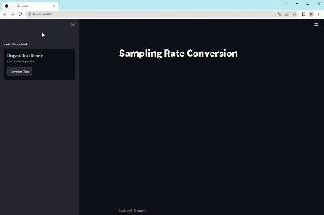

# SamplingRateConversion
サンプリング周波数変換処理を行うプログラム

# Overview
サンプリング周波数変換（アップサンプリングとダウンサンプリング）処理をStreamlitで実装したものです．

QiiteにあるようなPythonスクリプトは[script](./script/)フォルダに格納しており、サンプリング周波数変換とwavファイルのスペクトログラムを描画を実行することができます。

サンプルとして，基本周波数1000Hzの矩形波（test.wav）とその結果（test_up.wav, test_down.wav）が入っています．

コード内に問題がある可能性があるので，もしお気づきになられたら修正 or 連絡をお願い致します．


<!--  -->

# Usage
- 環境構築
  ```bash
  $pip install -r requirements.txt
  ```

- streamlitアプリの実行
  ```bash
  $streamlit run app.py
  ```

- スクリプトの実行
  - 周波数変換スクリプト
    ```bash
    $python script/sr_converter.py {input file path} {output dir path} --up {up sampling conversion} --down {down conversion rate}

    # 例
    $python script/sr_converter.py ./wav/test.wav ./wav --up 4 --down 4
    ```
  - 可視化スクリプト
    ```bash
    $python script/visualizer.py {input wav file path} -o {output file path} -N {FFT window}

    # 例
    $python script/visuazlier.py ./wav/test_up.wav -o ./result_png/up.png -N 512
    ```


# License
Copyright © 2022 T_Sumida Distributed under the MIT License.
